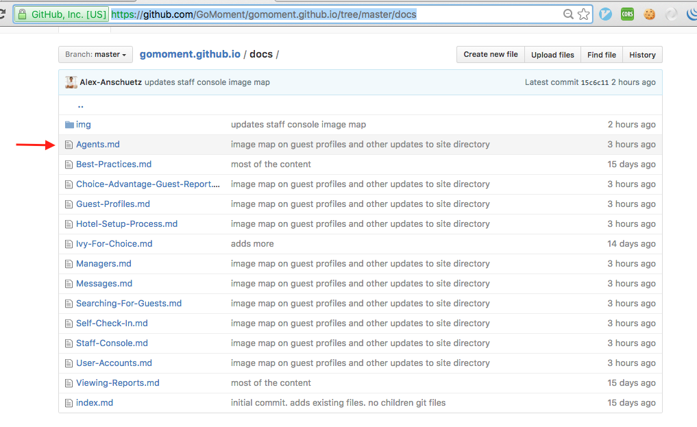
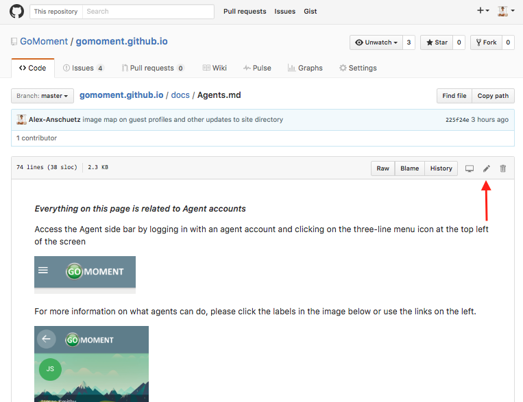
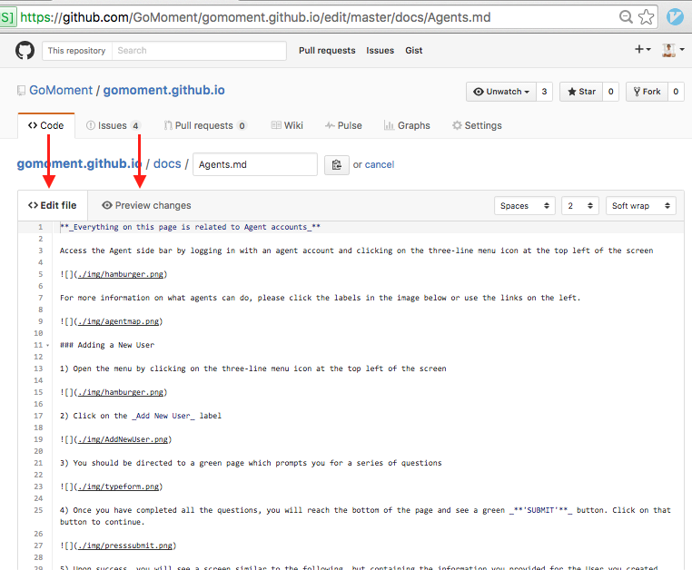
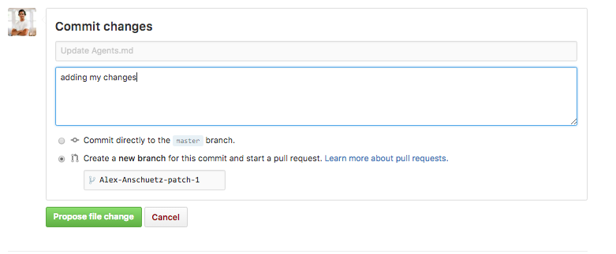
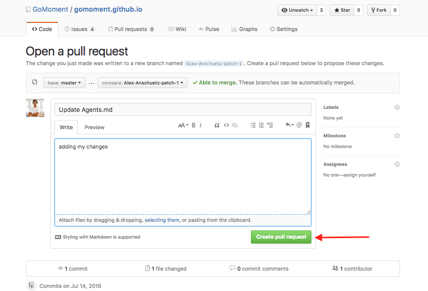
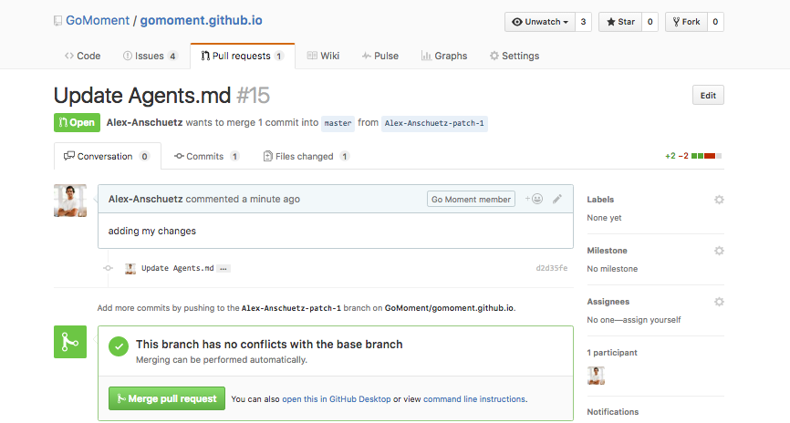

### Submitting Changes to IvyDocs

Submitting changes to IvyDocs is easy! The below process can be used to change content on ivydocs

1) Visit [this page](https://github.com/GoMoment/gomoment.github.io/tree/master/docs) to see all the Markdown pages that make up ivy docs

2) Click on the page you wish to change. We will use Agents page as example.   
  

3) After clicking Agents page you will see the following. Click the pencil logo to edit the Agents page.

3) On this page you can make changes to the page and preview them live to make sure it looks how you want it to. Click the `Edit file` button to make changes to the Agents page (it is written in markdown which is super simple, check out the cheat sheet [here](https://github.com/adam-p/markdown-here/wiki/Markdown-Cheatsheet#images) ). Click the `Preview changes` button to see what your changes look like.

4) At the bottom of the page, you can save your changes. Please leave a brief message in the box explaining why/what your changes are.
**!! IMPORTANT !!**  
**ALWAYS** choose the `Create new branch for this comit and start a pull request` option.  
**NEVER** chooose `commit directly to the master branch`.  
Click on `Propose file change` to submit changes

5) After clicking `Propose file change` , you will land on a page that looks similar to the following. Click on `Create pull request`

6) Thats it ! You will see a screen like the one below. Post the link to this page in dev channel and/or let alex know of your changes so they can be reviewed + merged into IvyDocs

