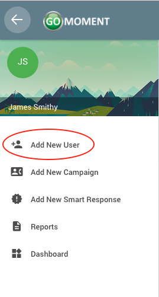

**_Everything on this page is related to Agent accounts_**

Access the Agent side bar by logging in with an agent account and clicking on the three-line menu icon at the top left of the screen

For more information on what agents can do, please click the labels in the image below or use the links on the left.

### Adding a New Users

1) Open the menu by clicking on the three-line menu icon at the top left of the screen

2) Click on the _Add New User_ label

3) You should be directed to a green page which prompts you for a series of questions

4) Once you have completed all the questions, you will reach the bottom of the page and see a green _**'SUBMIT'**_ button. Click on that button to continue.

5) Upon success, you will see a screen similar to the following, but containing the information you provided for the User you created. Click on the green _**'FINISHED'**_ button.

### Adding a New Campaign

1) Open the menu by clicking on the three-line menu icon at the top left of the screen

2) Click on the _Add New Campaign_ label  

3)You should be brought to this screen

4) Fill out the form with the corresponding information and click the green _**'SUBMIT'**_ button or press enter when you've completed the form.

5) Upon succesful submission of a new campaign you will be greeted with this screen, using the email you provided.

### Adding a New Smart Response

1) Open the menu by clicking on the three-line menu icon at the top left of the screen

2) Click on the _Add New Smart Response_ label

3) You should be brought to this screen. Click the green start button or press enter to continue.

4) Fill out the form with the corresponding information and click the green _**'SUBMIT'**_ button or press enter when you've completed the form.

5) Upon succesful submission of a new smart response you will be greeted with this screen, using the email you provided.

