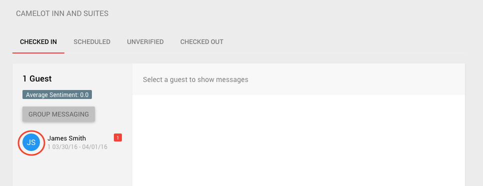

**_Guest Profiles_**

1.  One can easily view the profiles of any guest, at any hotel. See the [Staff Console](./Getting-To-The-Console.html) for the hotel at which you would like to view Guest Profiles.

3.  Once at the Staff Console, for any tab -- checked in, scheduled, unverified, checked out, you can click on the circle containing the guest's initials to view their profile. For example:

 

1.  After clicking on the guest's intials, you will be brought to their profile page which will look similar to the photo below.

For more information regarding what each tab (About, Visits, Timeline, and Notes) contains, please click on them in the image above or use the links on the left.