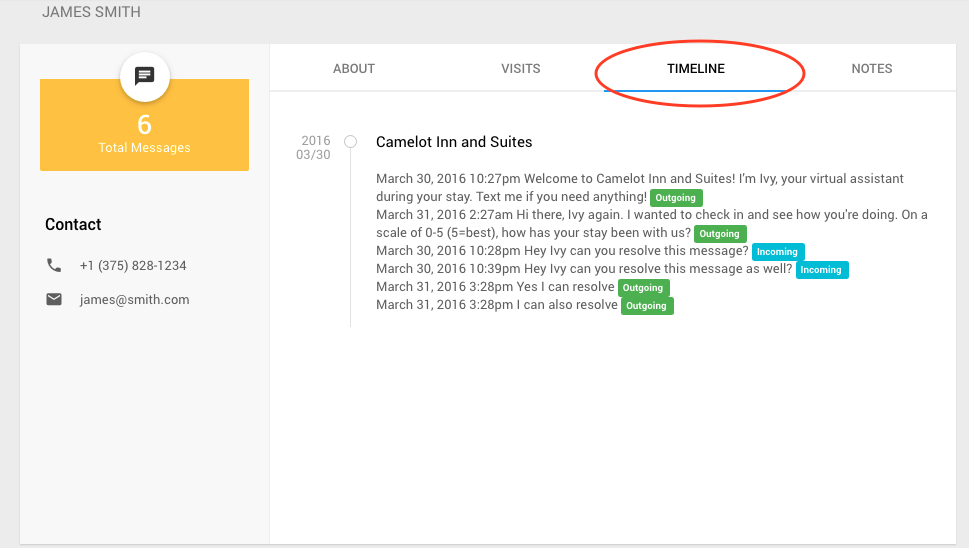

One can easily view the profiles of any guest, at any hotel.

1) See the [Staff Console](./Staff-Console/#getting-to-the-console) for the hotel at which you would like to view Guest Profiles.

2) Once at the Staff Console, for any tab -- checked in, scheduled, unverified, checked out, you can click on the circle containing the guest's initials to view their profile. For example:

 

3)  After clicking on the guest's intials, you will be brought to their profile page which will look similar to the photo below. For more information regarding what each tab (About, Visits, Timeline, and Notes) contains, please click on them in the image below or use the links on the left.

###_**About Tab**_      
The about tab contains guest's contact information and summary, shown below.   
  
  

###_**Visits Tab**_  
The visits tab contain's guests visit history. They are sorted by current, upcoming, or past visit and display the visit's corresponding hotel name and date.  

  

###_**Timeline Tab**_  
The timeline tab contains the guest's message history for each visit, in chronological order. Each message also displays its status (incoming, outgoing, delivered, scheduled etc.)  

###_**Notes Tab**_   
The notes tab contains any notes that were left for this guest. See _**[Notes on Guests](./Staff-Console/#notes-on-guests)**_  

