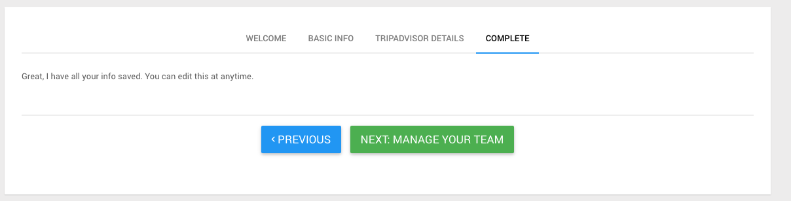

After creating hotel using [Ivy For Choice](./Ivy-For-Choice.html) , login with the account you used for that process and you will see your hotel is 'Initialized'. You can see step 3 to confirm this. There are three steps to setting up your hotel - [Setup Hotel Details](#setuphoteldetails) , [Manage Users](#manageusers) , and [Setup Messaging](#setupmessaging)

1. Open the menu by clicking on the three-line menu icon at the top left of the screen

2. Click 'Dashboard'

3. Scroll to find the hotel you created, and see that it is accompanied by a blue dot and the word 'Initialized'. Click the _**'GET STARTED'**_ button go continue setting up your hotel

#### <a name="setuphoteldetails">Setup Hotel Details</a>

4. The first section to complete is the **BASIC INFO** section. Complete the form with information corresponding to your hotel. Click the 'SAVE & NEXT' button to continue.

5. The second section to complete is the **TRIPADVISOR DETAILS** section. Simply provide the link to the trip advisor website for your property in the first field of the form (labeled URL), and enter your trip advisor stats below. Click the 'SAVE & NEXT' button to continue.

6. On the following screen all you need to do is click 'NEXT: MANAGE YOUR TEAM'.

#### <a name="manageusers">Manage Users</a>

7. At this point you should be at the screen pictured below. Here you can invite staff members to your hotel. To manage existing staff members, rather than adding new ones, please see [Manage Users](./Invite-And-Manage-Users.html#managing-users)

8. Fill out the form with information corresponding to the user you wish to add. If the user is already in the system they will simply be added to this hotel, if not already in the system they will receive a confirmation email. If you'd like to give this user manager capabilities (see [Managers](./Managers.html)), make sure the _**'Manager'**_ checkbox is checked. If you would like this user to receive notifications when guests text in, make sure the _**'Get immediate notifications'**_ checkbox is checked.Click _**'SEND AN INVITATION'**_ when you have completed the form.

9. If the user was not already in the system, you will see this message on the following page. If they are already in the system, they should be added to the hotel right away without an email invite.

Also the user who was invited will see an email similar to the one below

10. Once the user who was added confirms by clicking the **_Accept Invitation_** link in the email, they will be added to the list of users at the hotel. You can see their name on the list of users at the bottom of the screen.

11. Click the blue 'DONE' button at the top of the screen to continue.

#### <a name="setupmessaging">Setup Messaging</a>

12. On the next page you can select the hours you wish for Ivy to message your guests. Click the 'SAVE & NEXT' button to continue.

13. Next, you can see the welcome message Ivy automatically sends to your guests, and the responses she gives as well. This is non-editable. Click the 'SAVE & NEXT' button to continue.

14. On the next screen you are able to set up Ivy smart responses for your guests. You can provide a response for specific subjects, like `pool` or `wifi`, or contact our staff to set up responses for additional scenarios. Click the 'SAVE & NEXT' button to continue.

15. On the next screen you are able to create message templates. Message templates are exactly what they sound like, a predetermined message that you can quickly send to guests without having to type the content each time. Templates can serve as common responses related to specific situations. For example if a guest asks for a cot you can create a template that replies " Thank you. We have notified housekeeping and a cot will be up shortly."  

    As seen on the page, you can include {guest_name} or {hotel_name} in your template - when the guest receives the message {guest_name} appears as their name (example John Smith), and {hotel_name} appears as the property name (example Camelot Inn and Suites). Message template usage is further documented at [Viewing/Sending Messages to Guests](./Viewing-Sending-Messages-To-Guests.html). After clicking add new template, you can provide the name of the template and the message content in the dropdown. Click the 'SAVE & NEXT' button to continue.

16. On the next screen all you need to do is click the 'NEXT: SOFT LAUNCH' button to begin testing Ivy!

17. Once your hotel is in state 'soft_launch', you will see back on the dashboard...  
    ( Visit [https://rev1.gomoment.com/app/hotels](https://rev1.gomoment.com/app/hotels) or click the button pictured below by redoing the first two setps on this page. )  
    

... that your hotel now is now accompanied by an orange dot and the words 'Training in progress'

18. From this point you can access the [Staff Console](./Getting-To-The-Console.html), or [Check In a Guest](./Checking-A-Guest-In.html) at your hotel.  
    Additionally, at any point you can update the information provided during this process. Please see the instructions for the section you wish to update:  
    [Setup Hotel Details](./Setup-Hotel-Details.html)  
    [Manage Users](./Invite-And-Manage-Users.html#managing-users)  
    [Setup Messaging](./Setting-Up-Messaging.html),

19. An admin will need to transition your hotel's state to 'active' to fully engage Ivy.

