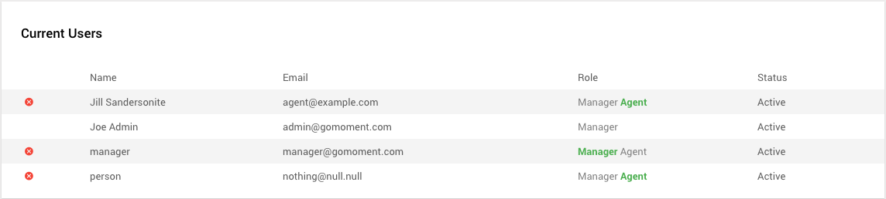
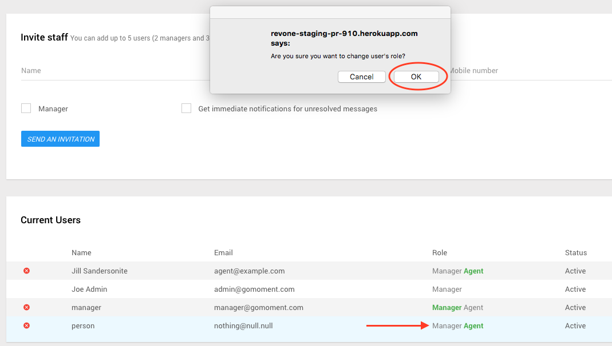

**_Everything on this page is related to Manager accounts_**

For more information on what managers can do, please click the labels from the dropdown menu in the image or use the links on the left.

 

### **_Setup Hotel Details_**

1) To Setup Hotel Details, log in with a manager account for the hotel you wish to setup messaging for. Upon log in, you should see a list of hotels this manager account is associated with. Click the 'MANAGE' button and then from the drop down menu click 'Hotel Details'.

2) The first section to complete is the **BASIC INFO** section. Complete the form with information corresponding to your hotel. If you choose yes for `Would you like to allow guests to opt-in by sending Ivy a text message first?` , guests can text in to the hotel and will appear on the unverified visits tab (add link when you create brief section explaining visits tabs). Click the 'SAVE & NEXT' button to continue.

3) The second section to complete is the **TRIPADVISOR DETAILS** section. Simply provide the link to the trip advisor website for your property in the first field of the form (labeled URL), and enter your trip advisor stats below. Click the 'SAVE & NEXT' button to continue.

4) On the following screen all you need to do is click 'NEXT: MANAGE YOUR TEAM' to continue to [Managing Users](./Invite-and-Manage-Users.html#managing-users) . If you do not see 'NEXT: MANAGE YOUR TEAM', this process has already been completed. Don't worry, we will still save your changes.

###**_Manage Users Page_**

1) You can [Invite Users](#inviting-users) or [Manage Users](#managing-users) from the **_Manage Users_** page. To access the manager users page, log in with a manager account for the hotel you wish to manage users at. Upon log in, you should see a list of hotels this manager account is associated with. Click the _**'MANAGE'**_ button and then form the drop down menu click **_'Users'_** to continue to the **_Manage Users_** page

2) You should find yourself on the **_<a name="manage-users">Manage Users</a>_** page which looks like the following.

###**_<a name="inviting-users">Inviting Users</a>_**

1) Following from step two at the [top of the page page](#manage-users) you will see the Manage Users page for the hotel you selected. Here you can see the form to invite users, and at the bottom of the page can see the list of current users at the hotel.

2) Fill out the form with information corresponding to the user you wish to add. If the user is already in the system they will simply be added to this hotel, if not already in the system they will receive a confirmation email. If you'd like to give this user manager capabilities (see [Managers](./Managers.html)), make sure the _**'Manager'**_ checkbox is checked. If you would like this user to receive notifications when guests text in, make sure the _**'Get immediate notifications'**_ checkbox is checked. Click _**'SEND AN INVITATION'**_ when you have completed the form.

3) If the user was not already in the system, you will see this message on the following page. If they are already in the system, they should be added to the hotel right away without an email invite.

Also the user who was invited will see an email similar to the one below

4) Once the user who was added confirms by clicking the **_Accept Invitation_** link in the email, they will be added to the list of users at the hotel. You can see their name on the list of users at the bottom of the screen.

###**_<a name="managing-users">Managing Users</a>_**

1) After completing [Setup Hotel Details](./Setup-Hotel-Details.html) or following from step two at the [top of the page](#manage-users) you will see the Manage Users page for the hotel you selected. Here you can see the form to invite users, and at the bottom of the page can see the list of current users at the hotel.

2) As a manager, you are able to remove or change the role of a user.

2a) To remove a user's role, simply click the X next to their name, and then select OK in the pop up window.

You will see the user will be removed from the list of users at the hotel 

2b) To change the role of a user, simply click the role you would like that user to have. Each user has their current role in the same row as their name. If there is one role, that is their role. If there are two roles, the user's role is the one highlighted in green text.

Agents have the ability to access the [Staff Console](./Staff-Console.html) and [Check Guests In](./Checking-A-Guest-In.html), while Manager abilities are outlined on [Managers](./Managers.html) page.

For example lets change person from agent to manager. We click on `manager` in the role column for the user `person` and click OK in the pop up window.

You will see that `manager` has gone from grey to green, indicating that the user's role is now manager

3) If you are managing users after [Setup Hotel Details](./Setup-Hotel-Details.html), click the green 'DONE' button at the top of the screen to continue to [Setting Up Messaging](./Setting-Up-Messaging.html)

### **_Set Up Messaging_**

1) After completing [Managing Users](./Invite-and-Manage-Users.html#managing-users) you should find yourself at the screen picture in step 2 on this page. Otherwise, to setup messaging, log in with a manager account for the hotel you wish to setup messaging for. Upon log in, you should see a list of hotels this manager account is associated with. Click the 'MANAGE' button and then form the drop down menu click 'Messaging' to continue to setup messaging

2) You will be directed to this page. On this page you can select the hours you wish for Ivy to message your guests. Click the 'SAVE & NEXT' button to continue.

3) On the next screen you can see the welcome message Ivy automatically sends to your guests, and the responses she gives as well. This is non-editable. Click the 'SAVE & NEXT' button to continue.

4) On the next screen you are able to set up Ivy smart responses for your guests. You can provide a response for specific subjects, like `pool` or `wifi`, or contact our staff to set up responses for additional scenarios. Click the 'SAVE & NEXT' button to continue.

5) On the next screen you are able to create message templates. Message templates are exactly what they sound like, a predetermined message that you can quickly send to guests without having to type the content each time. Templates can serve as common responses related to specific situations. For example if a guest asks for a cot you can create a template that replies " Thank you. We have notified housekeeping and a cot will be up shortly." As seen on the page, you can include {guest_name} or {hotel_name} in your template - when the guest receives the message {guest_name} appears as their name (example John Smith), and {hotel_name} appears as the property name (example Camelot Inn and Suites). Message template usage is further documented at [Viewing Sending Messages to Guests](./Viewing-Sending-Messages-to-Guests.html). After clicking add new template, you can provide the name of the template and the message content in the dropdown. Click the 'SAVE & NEXT' button to continue.

6) On the next screen all you need to do is click the 'NEXT: SOFT LAUNCH' button to begin testing Ivy! If you do not see 'NEXT: SOFT LAUNCH', this process has already been completed. Don't worry, we will still save your changes.

