For more information on Accepting(LINK), Assigning(LINK), or Resolving(LINK) a message, please click the labels in the image below or use the links on the left.

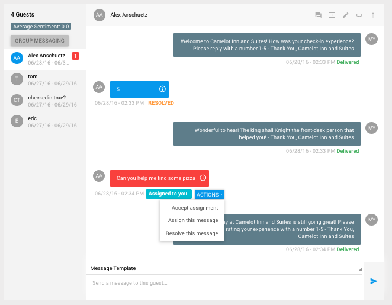

###**_Accepting A Message_**

1) When a message is assigned to you, there will be a label beneath the message stating this.

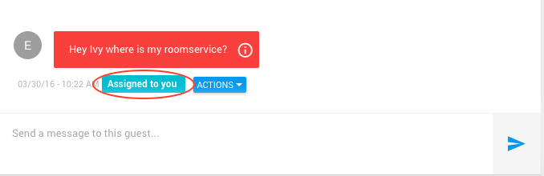

2) Click on the blue _**'ACTIONS'**_ button. Click on _Accept assignment_ to accept this message being assigned to you

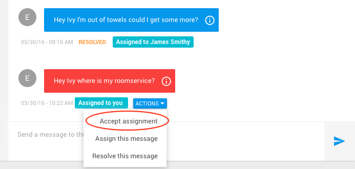

3) After clicking on _Accept assignment_, you will see the following screen

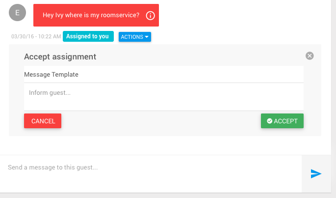

4) Select a message template from the _Message Template_ drop down menu, or type a custom message in the box. 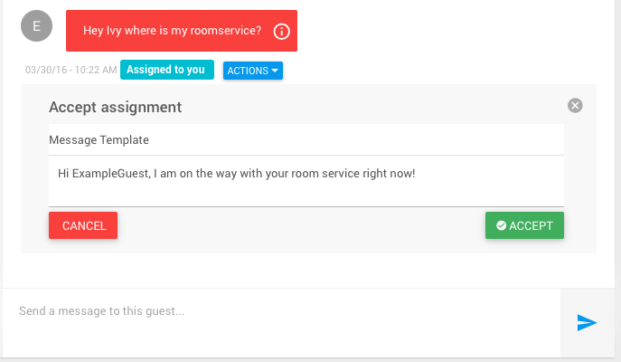 Once you've selected a template message or typed your own message, click the green _**'ACCEPT'**_ button to send the message to the guest.

6) After clicking the green _**'ACCEPT'**_ button, you should see that the message has been sent to the guest.

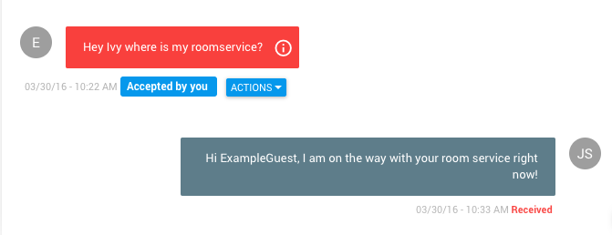

### **_Assigning A Message_**

1) To assign a message, you must first navigate to the message you wish to assign. Begin by opening the menu by clicking on the three-line menu icon at the top left of the screen.

2) Select a hotel from the list

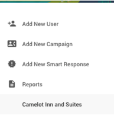

3) On the following screen, in the left panel, click on the guest that the message you wish to assign belongs to.

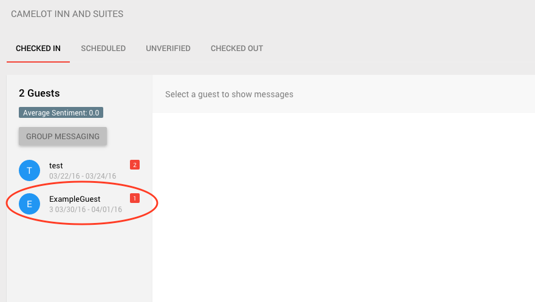

4) After clicking on the corresponding guest, click on the blue _**'ACTIONS'**_ button. Click on _Assign this message_ to assign the message.

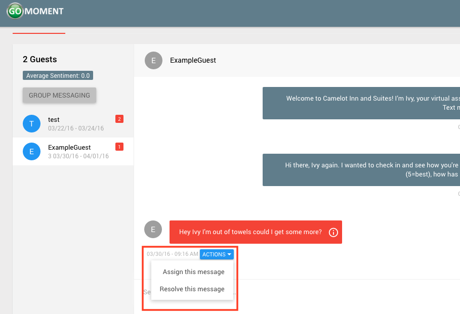

5) After clicking on _Assign this message_, you will see the following screen

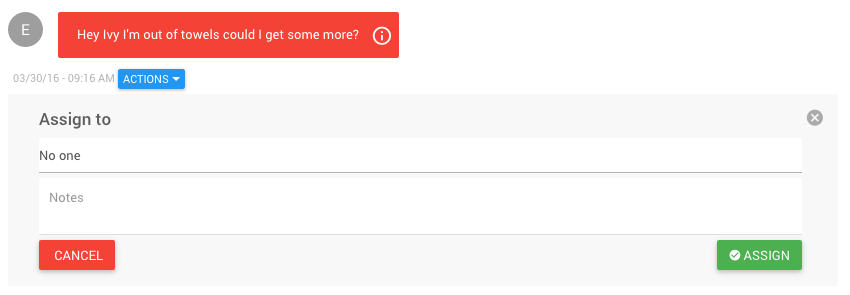

6) Click on _No One_ for a dropdown menu of all the available users you can assign this message to. To add a user who is not on the list, please see _**'ADDUSER'**_

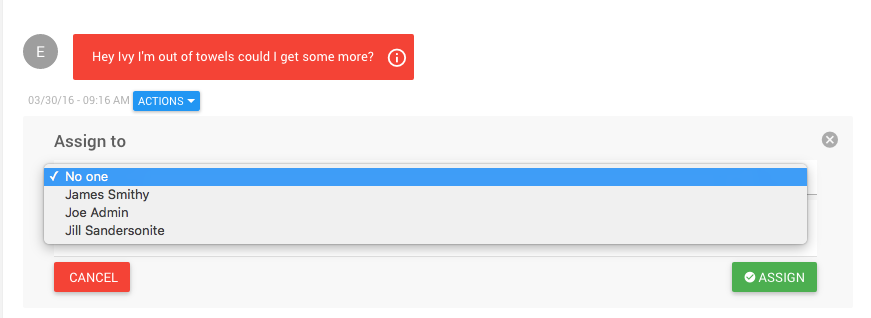

7) Select the user you wish to assign the message to. If you'd like to leave a note for the user, there is a notes field where you can type the note you'd like to leave.

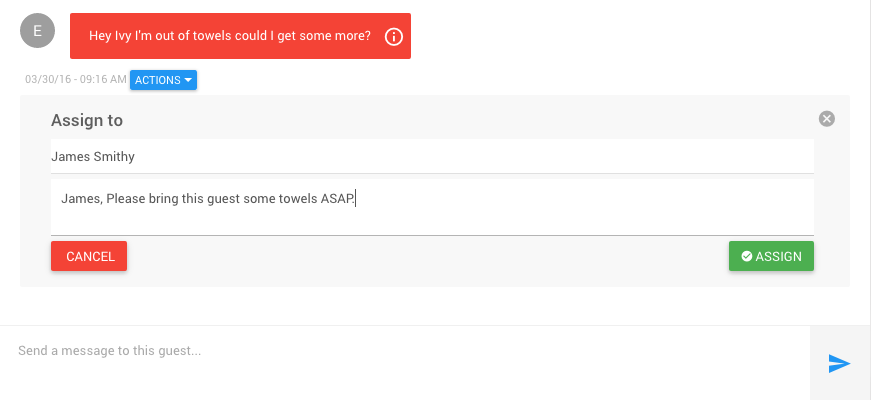

Once you've completed the form click the green _**'ASSIGN'**_ button

8) After clicking the green _**'ASSIGN'**_ button, you should see that the user you selected has been assigned to this message.

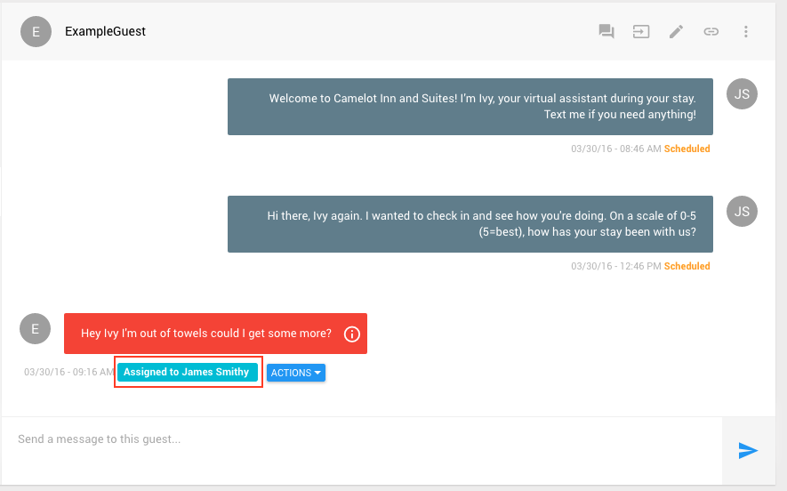

### **_Resolving a Message_**

1) To resolve a message, you must first navigate to the message you wish to resolve. We will be using the message from the above example, **_Assigning A Message_**. Again begin by opening the menu by clicking on the three-line menu icon at the top left of the screen.

2) Select a hotel from the list

3) On the following screen, in the left panel, click on the guest that the message you wish to assign belongs to.

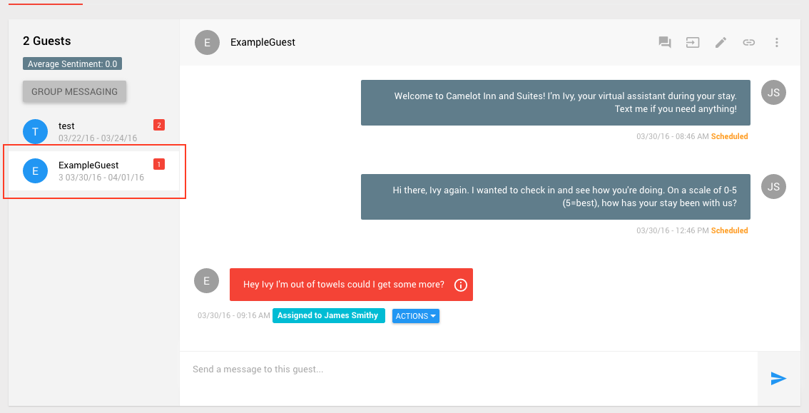

4) After clicking on the corresponding guest, click on the blue _**'ACTIONS'**_ button. Click on _Resolve this message_ to resolve the message.

5) After clicking on _Resolve this message_, you will see the following screen

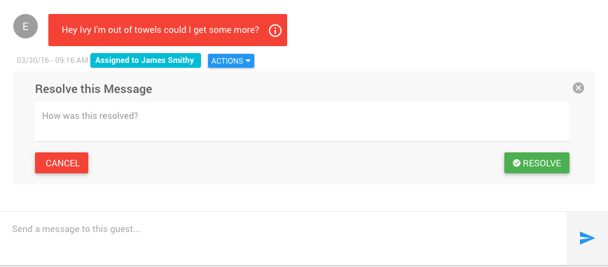

6) Enter a note regarding how the message was resolved. Notice that unresolved messages are red, and resolved messages are blue and say resolved under them.

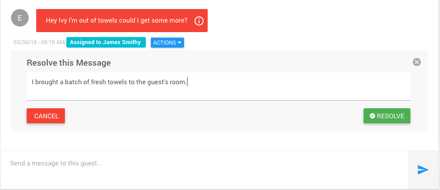

Once you've completed the form click the green _**'RESOLVE'**_ button

7) After clicking the green _**'RESOLVE'**_ button, you should see that the message has been resolved.

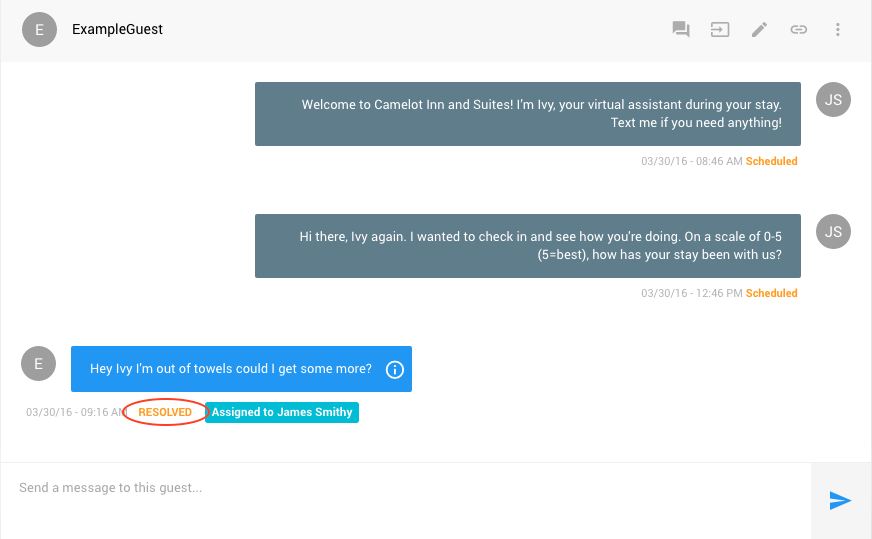