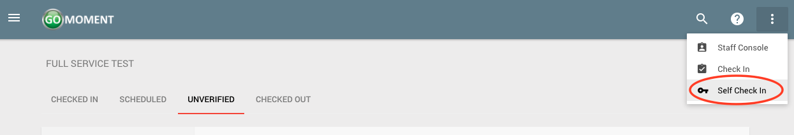
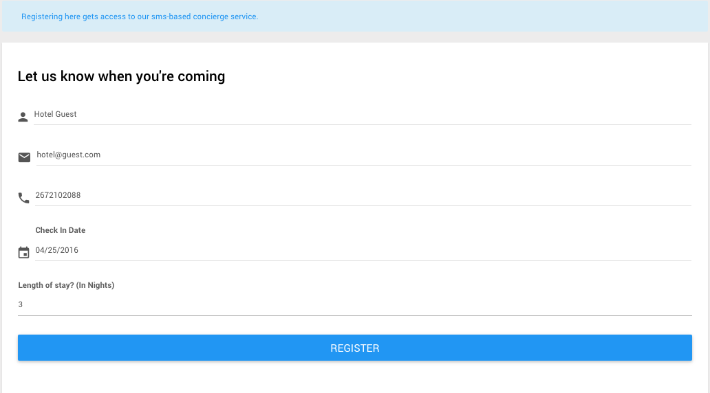
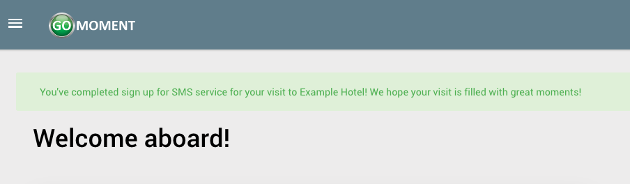
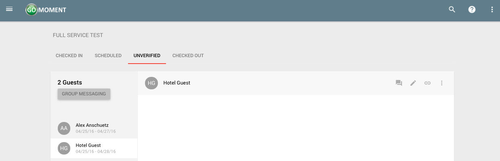

### Self Check In

Properties are able to send welcome messages to their guests. Within the welcome message, there is a link which gives the guest the ability to check themselves in. Self check in is enabled by default, please [contact GoMoment staff](mailto:support@gomoment.com?Subject=Self%20Check-in) to turn this feature off.

1)  With self check in enabled, guests are able to self check in through the UI. Once logged in, click the self check in option from the drop down menu in the top right hand corner.

2)  On the following page you see a form to fill out, with fields for the guest information. The guest can enter their information here and click the blue _**'REGISTER'**_ button to complete the self check in process.

3)  Upon success after clicking the blue _**'REGISTER'**_ button you will see the following screen.

4)  Back on the staff console (see [Getting to the Console](/Staff-Console/#getting-to-the-console) the guest who self checked in will appear among the unverified visits.

