###**_What is the Staff Console?_**

The Staff Console is the primary access point to view all guest details, open requests, sentiment, and conversations. You will always be directed to the [CHECKED IN](./Staff-Console/#checked-in) tab first because this is where you’ll find your current in-house guests. Please use the links on the left or click on areas in the image below to learn more about the Staff Console.

###**_Getting To The Console_**

1) Log in and see all the hotels your account is associated with.

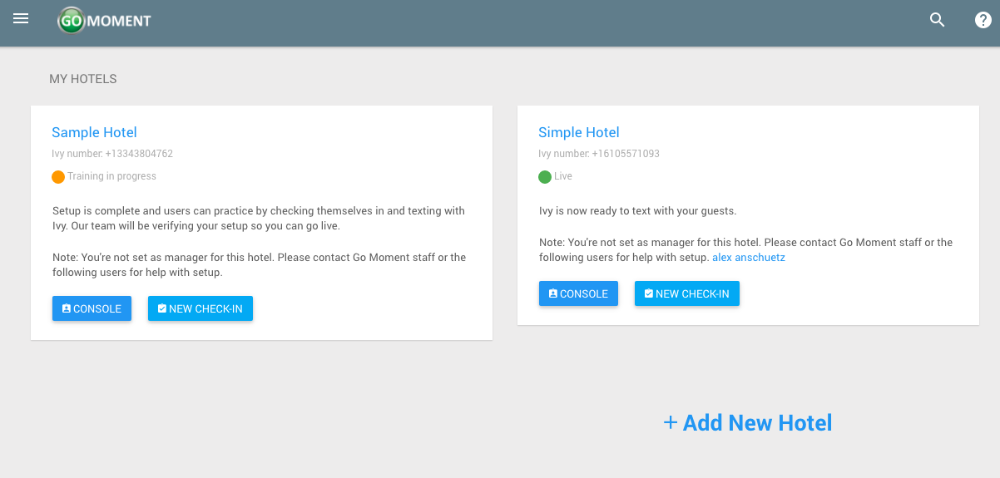

2) Click the blue _**'CONSOLE'**_ button next to the hotel for which you wish to access the Staff Console.

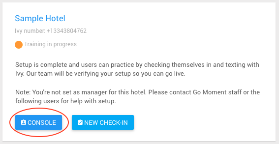

3) You should see a console like this:  

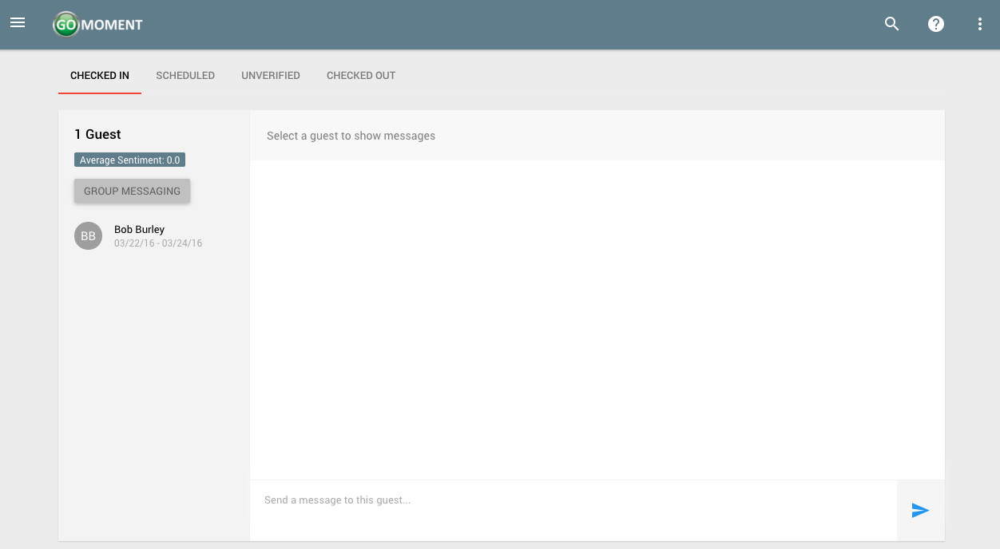

**_Within the console you can see four tabs at the top: [CHECKED IN](./Staff-Console/#checked-in), [SCHEDULED](./Staff-Console/#scheduled), [UNVERIFIED](./Staff-Console/#unverified), and [CHECKED OUT](./Staff-Console/#checked-out)_**

**_<a name="checked-in">Checked In Visits</a>_**

Checked in visits are guests who are currently checked in and have a check out date in the future. If you click the checked in tab, you can see all the guests who currently have checked in visits at the hotel.

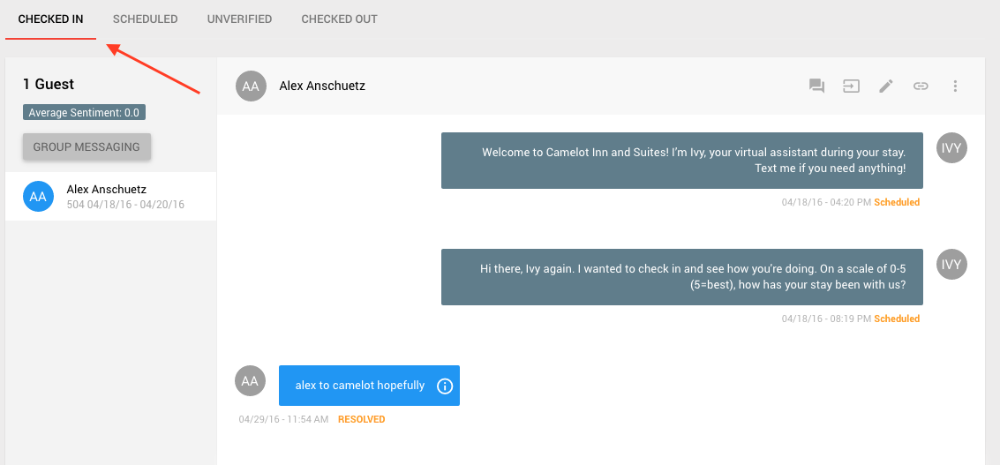

**_<a name="scheduled">Scheduled Visits</a>_**

Scheduled gvisits are guests who are have a visit at the hotel with a check in date in the future. If you click the scheduled tab, you can see all the guests who currently have scheduled in visits at the hotel.

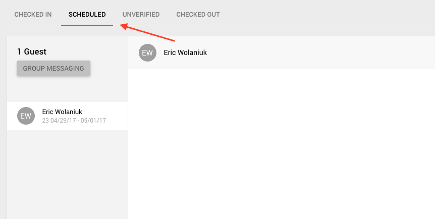

**_<a name="unverified">Unverified Visits</a>_**

Unverified visits are guests who have texted in to the hotel but may or may not have legitimate visit information. If you click the unverified tab, you can see all the guests who currently have unverified visits at the hotel.

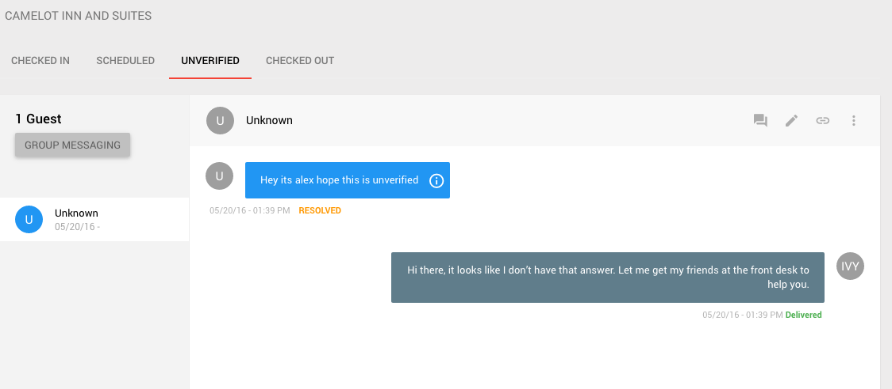

If the guest is legitimate and you would like to check them in, click the pencil icon to verify the visit.

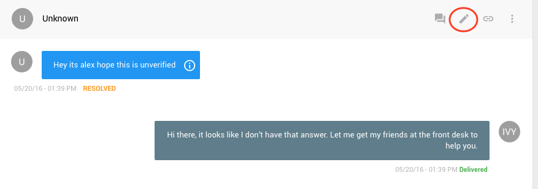

On this page enter all the corresponding information for the guest's visit. Click 'VERIFY' to check the guest in and save this information to their visit.

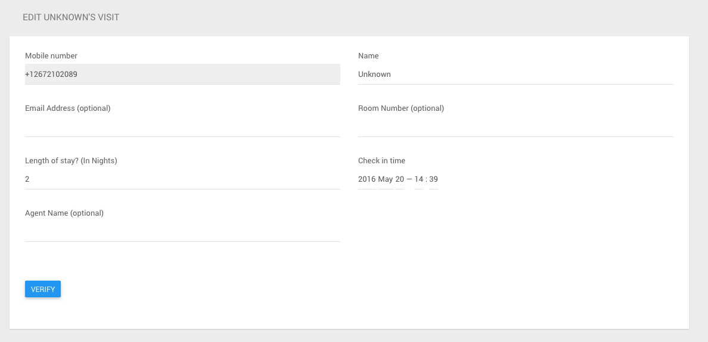

**_<a name="checked-out">Checked Out Visits</a>_**

Checked out visits are guests who are currently checked out of the hotel. Meaning their check out date is today's date or in the past. If you click the checked out tab, you can see all the guests who currently have checked out visits at the hotel.

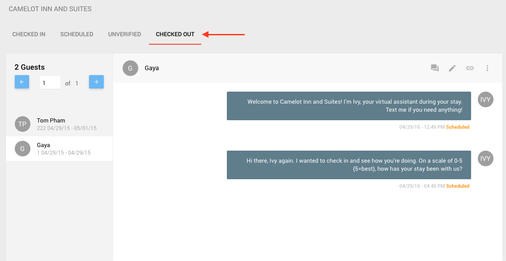

### **_Viewing/Sending Messages to Guests_**

1) From the staff console, select a guest from the panel on the left and click on their name

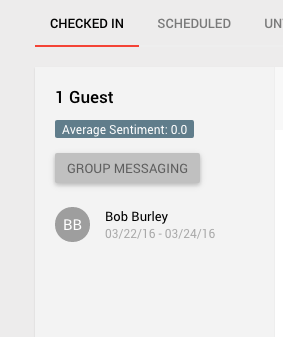

2) You should now see the conversation appear on the right inside of the panel

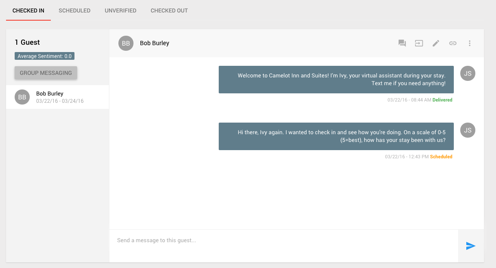

3) You can send a message directly to a guest by writing on the panel directly

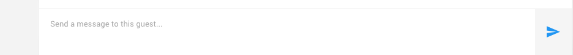

4) You can send a custom message based on a template as well by selecting the diagonal arrow above the message box.

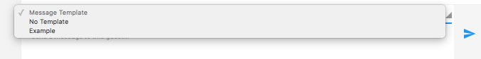

5) You should see a custom message filled into the message field below.

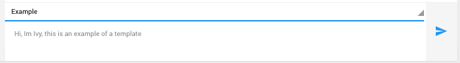

### **_Notes on Guests_**

1) You can make notes about a guest from the staff console by clicking on the chat icon inside of the console panel

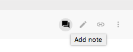

2) From the dialog window, you can add a new note.

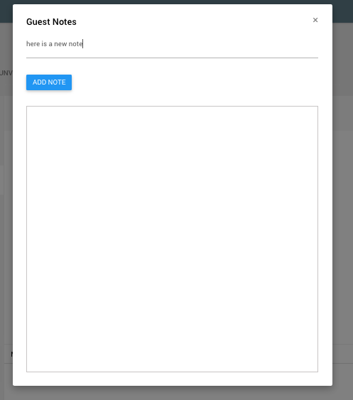

Click `ADD NOTE` and it will appear as part of list of all previous notes

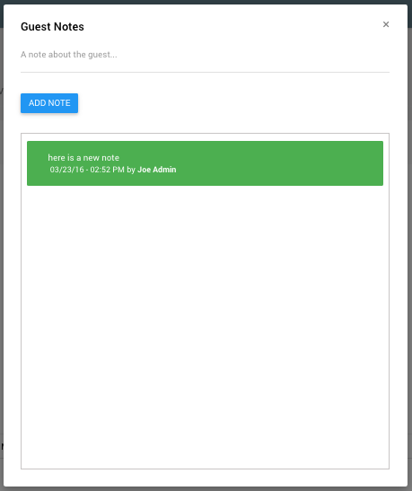

### **_Removing a Guest Visit_**

1) If a visit is created by mistake, or if a guest cancels, you may want to remove their visit. From the staff console, you can remove a guest visit by selecting a given guest from the list on the left of the console, and clicking the three vertical dots at the right, and then click remove visit.

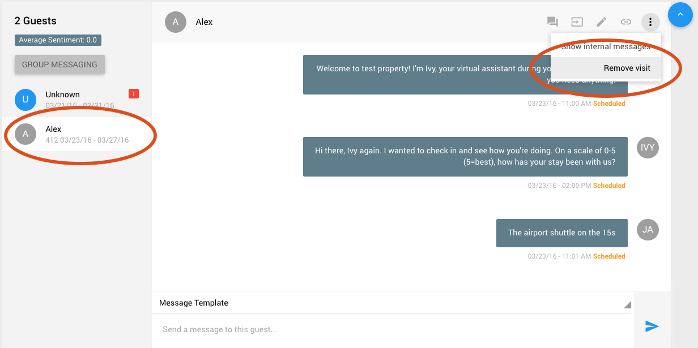

2) This screen appears next, click remove to finalize removing the guest.

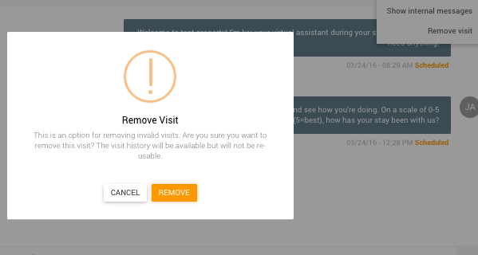

### **_Editing a Guest Visit_**

1) From the staff console, you can edit a guest visit by selecting a given gueset from the list on the left on the console, and then click the pencil logo at the right to edit the visit.

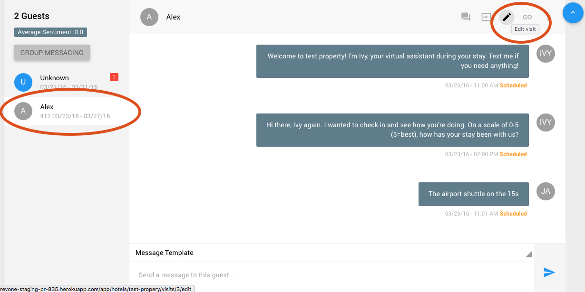

2) After clicking edit visit, you will be taken to this page where you can edit the guests visit.

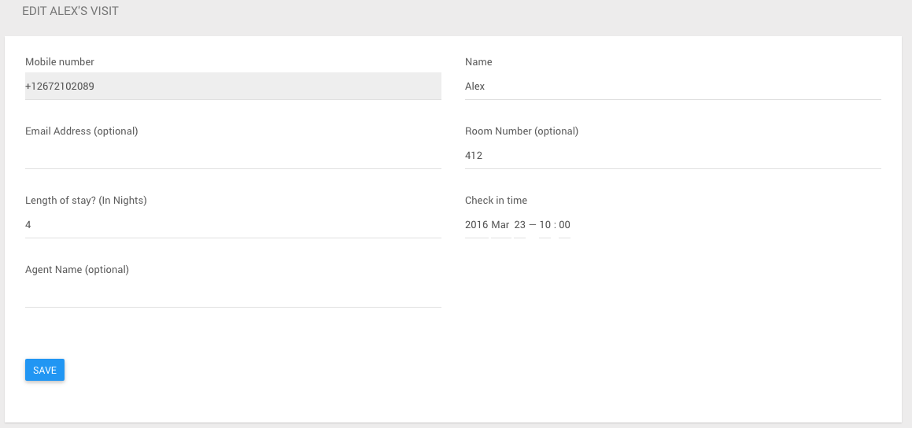

3) When finished don't forget to click the save button at the bottom left.

### **_Checking A Guest In_**

A1) From the staff console, click the three vertical dots at the top right, and click on check in.

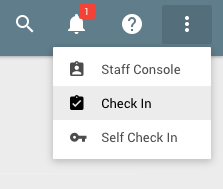

A2) Enter the guest's mobile number to use for messaging

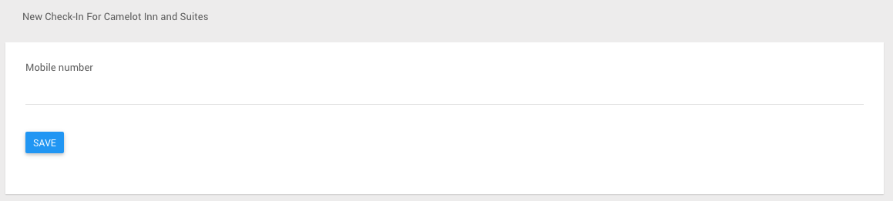

A3) Click the blue _**'SAVE'**_ button to proceed.

A4) Fill out the form and click save once more when you've completed the form.

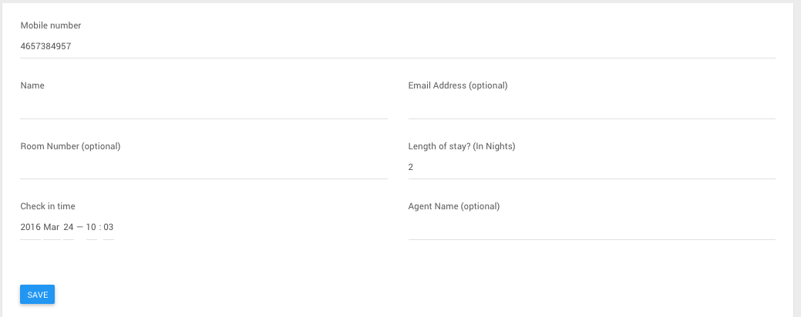

Alternatively, you can check in a guest from the dashboard.

B1) Open the menu by clicking on the three-line menu icon at the top left of the screen

B2) Click 'Dashboard'

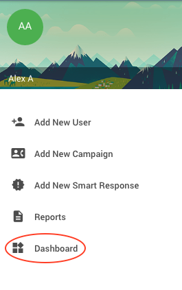

B3) Click the blue _**'NEW CHECK-IN'**_ button to check a guest in. Follow the instructions starting from A2

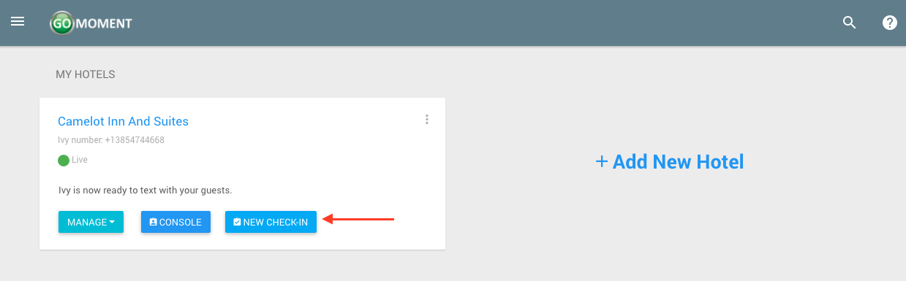