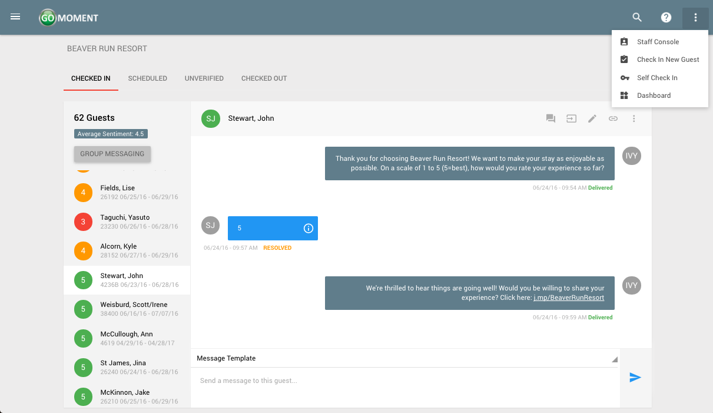

### Staff Console

Please use the links on the left or click on areas in the image below to learn more about the Staff Console.

 <map id="Map" name="Map"> <area shape="rect" alt="" title="" coords="65,405,190,100" href="./Viewing-Sending-Messages-to-Guests.html" target=""> <area shape="rect" alt="" title="" coords="190,405,650,340" href="./Viewing-Sending-Messages-to-Guests.html" target=""> <area shape="rect" alt="" title="" coords="537,105,557,130" href="./Notes-on-Guests.html" target=""> <area shape="rect" alt="" title="" coords="605,50,700,70" href="./Checking-A-Guest-In.html" target=""> <area shape="rect" alt="" title="" coords="579,105,599,130" href="Editing-A-Guest-Visit.html" target=""> <area shape="rect" alt="" title="" coords="621,105,641,130" href="Removing-A-Guest-Visit.html" target=""> <area shape="rect" alt="" title="" coords="65,65,121,90" href="Getting-To-The-Console.html#checked-in" target=""> <area shape="rect" alt="" title="" coords="120,65,175,90" href="Getting-To-The-Console.html#scheduled" target=""> <area shape="rect" alt="" title="" coords="175,65,229,90" href="Getting-To-The-Console.html#unverified" target=""> <area shape="rect" alt="" title="" coords="233,65,293,90" href="Getting-To-The-Console.html#checked-out" target=""></map>
