### **_Signing Up_**

Users will need to be [invited by a manager](./Managers/#inviting-users) to access their hotel on Ivy. 

In the meantime, one can sign up for an account by following the instructions below.

1) Navigate to the home page of the app, or if you are currently logged in, log out. Click the orange _**'REGISTER'**_ button

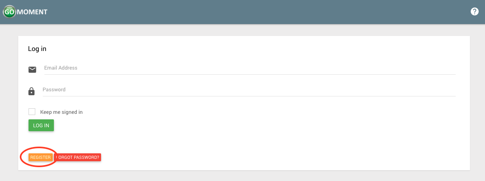

2) Fill out the form with the corresponding information and click the green _**'REGISTER'**_ button when you've completed the form.

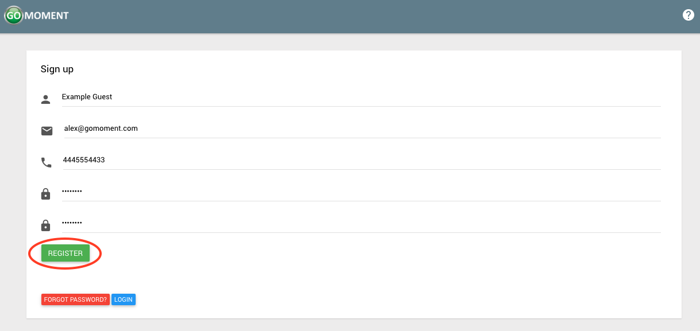

3) After clicking register you will see a page that looks like the following.

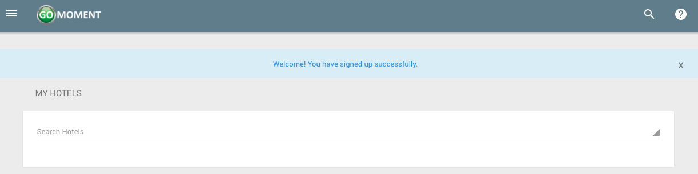

4) You will have acccess to the site with your account for 2 days from the time of creation. After that you will need to verify your account. Check the email you registered with and you will see an email that looks like the following. Click on _**Confirm My Account**_ to finalize the registration process for this account.

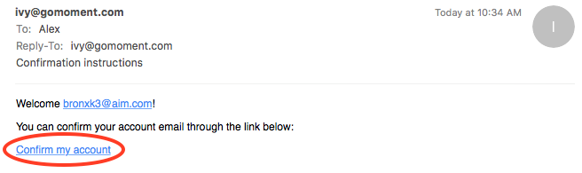

5) After clicking this button your account will be confirmed and you will see the following screen. No more steps are needed. You now have a functioning account.

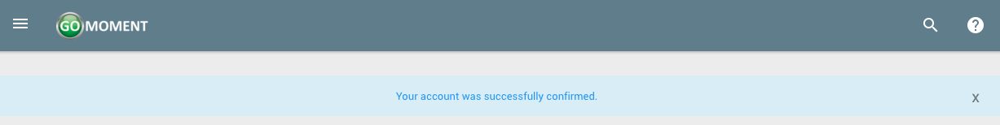

###**_User Account Settings_**

1) Open the menu by clicking on the three-line menu icon at the top left of the screen

2) Click on your name near the top of the menu that appears.

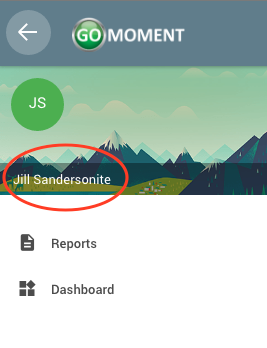

3) After clicking on your name, click on the _settings_ button

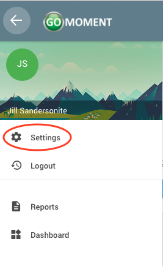

4) On the following page you will see a form that looks like the following.

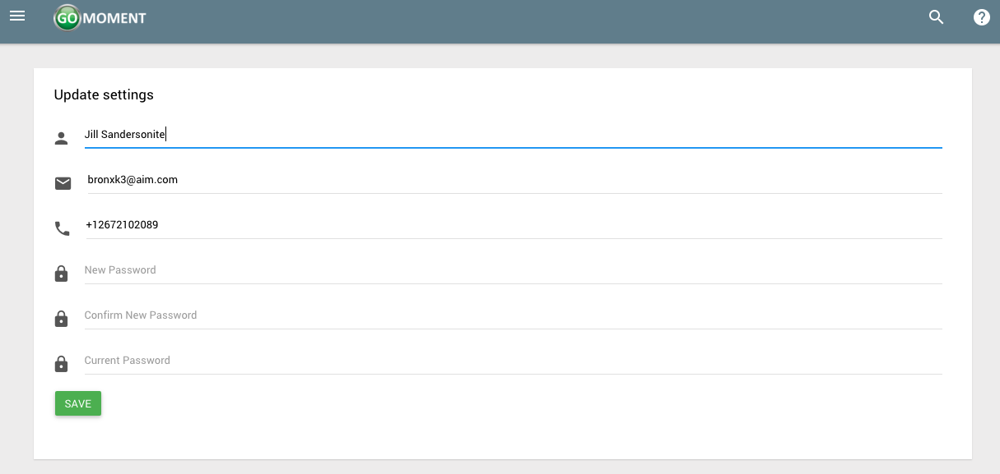

5) Update the form with any information you wish to change. Click the green _**'SAVE'**_ button when you are finished

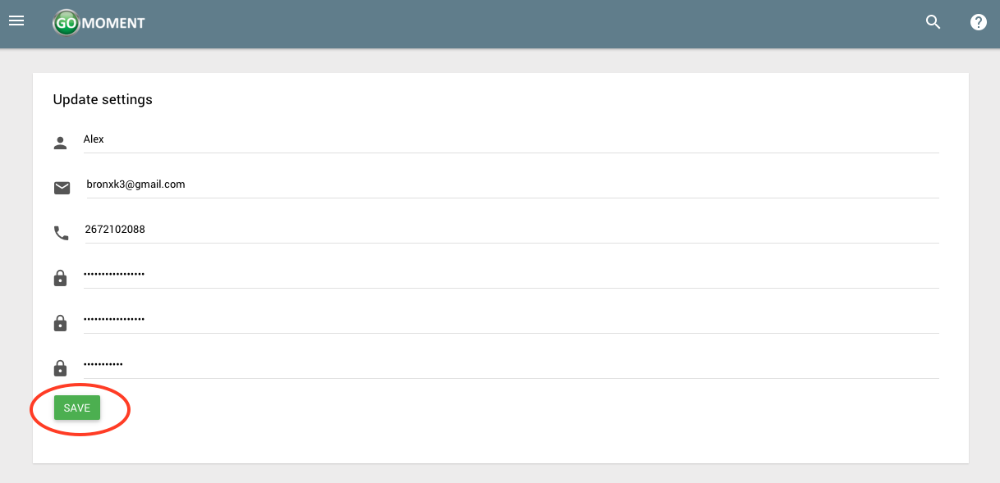

6) If the changes you made to your account included changing your email, you will be directed to the following page.

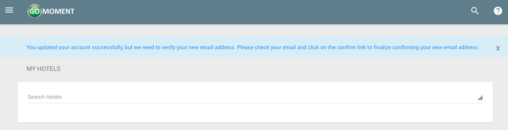

Otherwise your account will update instantly and you will see the following screen.

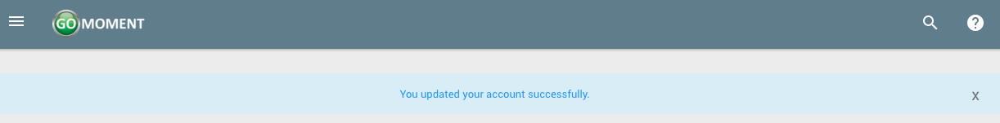

7) If you did change your email you need to continue to finalize your changes. Check the inbox of the email that you signed up with and you will see an email with the following content. Click _**Confirm My Account**_ to finalize the changes you made to your account.

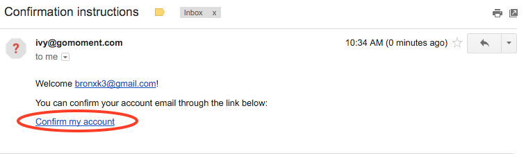

8) After clicking _**Confirm My Account**_ your account will be succesfully confirmed and you will see the following screen.

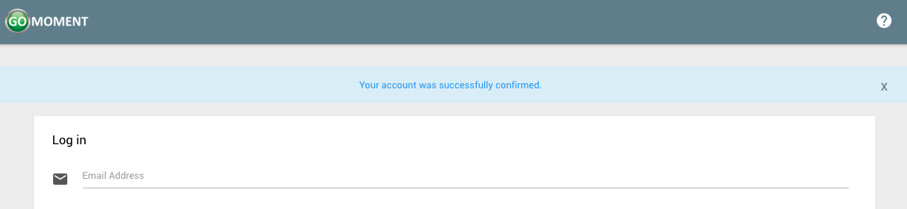

###**_Forgot Password_**

1) In the case you forget your password, navigate to the home screen (while logged out) and click the red _**FORGOT PASSWORD**_ button.  
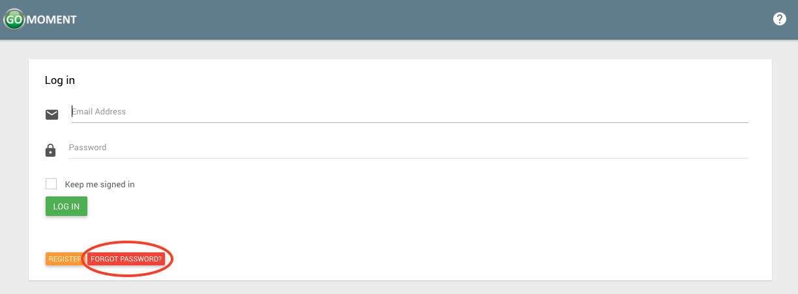

2) On the following page enter the email for the account for which you wish to recover the password. Click the green _**SUBMIT**_ button to continue.

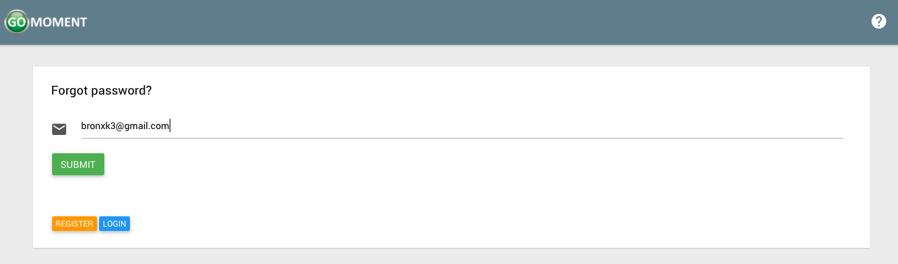

3) The following screen will display this message.

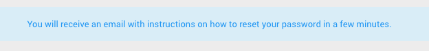

4) Check the inbox of the email address you just entered. You will see an email with instructions on resetting your password. Click on _**Change my password**_ to update your password.

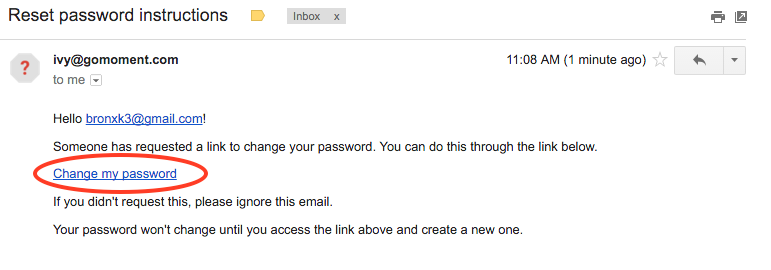

5) After clicking the link in the email you will be redirected to the following page. Enter the new password you desire in both fields and click on the green _**SAVE**_ button to continue.

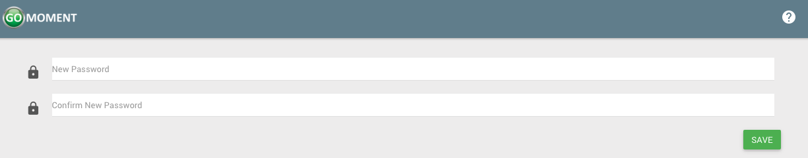

6) Once your password is successfully update you will see the following screen.

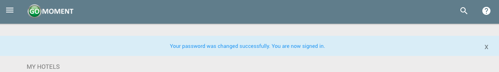