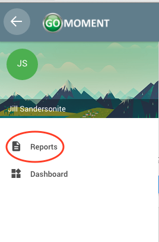
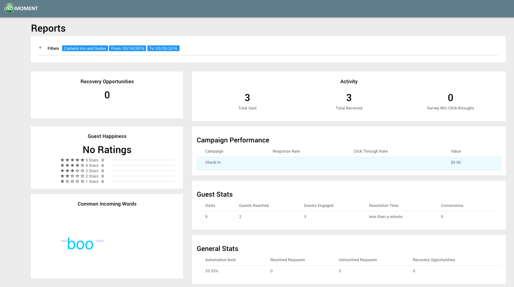
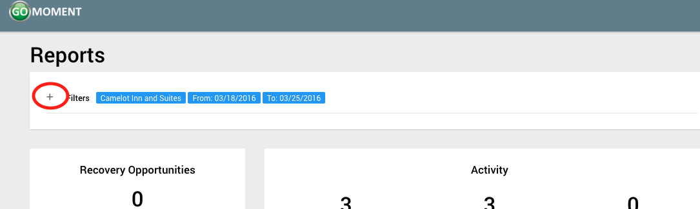
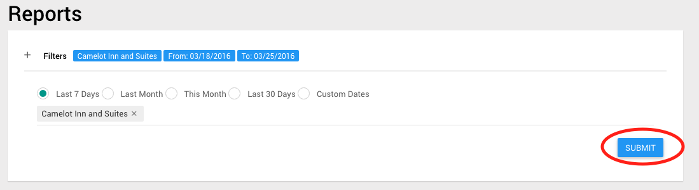

**_Viewing Reports_**

1) Open the menu by clicking on the three-line menu icon at the top left of the screen

2) Click on the _Reports_ label

3) You should be taken to the reports page. Here you can view all the different statistics including average guest happiness ratings, common words that guests respond with, overall visit trends, recovery opportunities, etc.

4) If you want to filter the data, you can adjust filters at the top of the page by clicking the + sign under Reports.

5) Click on the blue _**'SUBMIT'**_ button when to apply the filters.

