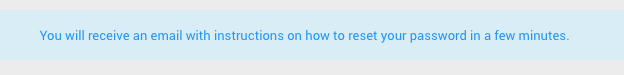

**_Forgot Password_**

1) In the case you forget your password, navigate to the home screen (while logged out) and click the red _**FORGOT PASSWORD**_ button.  

2) On the following page enter the email for the account for which you wish to recover the password. Click the green _**SUBMIT**_ button to continue.

3) The following screen will display this message.

4) Check the inbox of the email address you just entered. You will see an email with instructions on resetting your password. Click on _**Change my password**_ to update your password.

5) After clicking the link in the email you will be redirected to the following page. Enter the new password you desire in both fields and click on the green _**SAVE**_ button to continue.

6) Once your password is successfully update you will see the following screen.

