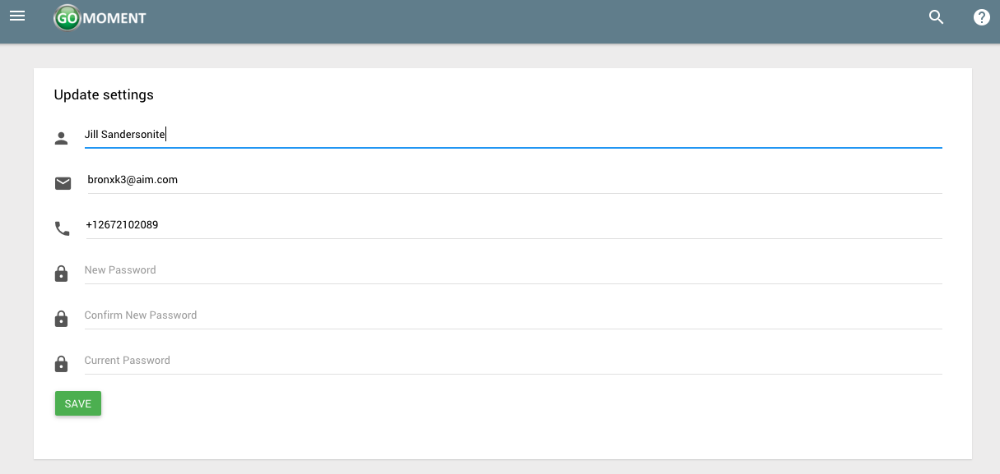

**_User Account Settings_**

1) Open the menu by clicking on the three-line menu icon at the top left of the screen

2) Click on your name near the top of the menu that appears.

3) After clicking on your name, click on the _settings_ button

4) On the following page you will see a form that looks like the following.

5) Update the form with any information you wish to change. Click the green _**'SAVE'**_ button when you are finished

6) If the changes you made to your account included changing your email, you will be directed to the following page.

Otherwise your account will update instantly and you will see the following screen.

7) If you did change your email you need to continue to finalize your changes. Check the inbox of the email that you signed up with and you will see an email with the following content. Click _**Confirm My Account**_ to finalize the changes you made to your account.

8) After clicking _**Confirm My Account**_ your account will be succesfully confirmed and you will see the following screen.

