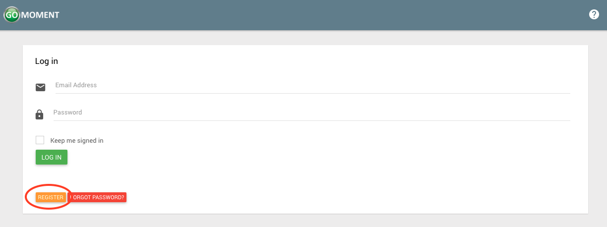
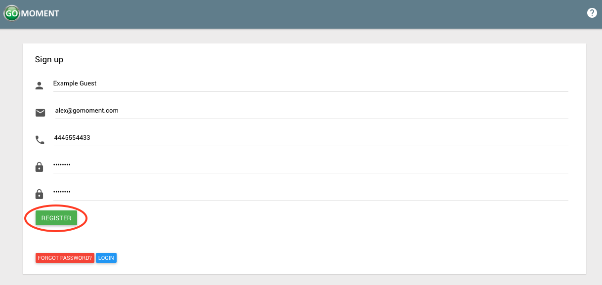
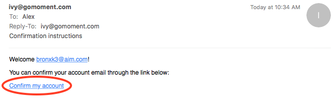

**_Signing Up_**

Users will need to be [invited by a manager](Invite-And-Manage-Users.html#inviting-users) to access their hotel on Ivy. In the meantime, one can sign up for an account by following the instructions below.

1) Navigate to the home page of the app, or if you are currently logged in, log out. Click the orange _**'REGISTER'**_ button

2) Fill out the form with the corresponding information and click the green _**'REGISTER'**_ button when you've completed the form.

3) After clicking register you will see a page that looks like the following.

4) You will have acccess to the site with your account for 2 days from the time of creation. After that you will need to verify your account. Check the email you signed registered with and you will see an email that looks like the following. Click on _**Confirm My Account**_ to finalize the registration process for this account.

5) After clicking this button your account will be confirmed and you will see the following screen. No more steps are needed. You now have a functioning account.

